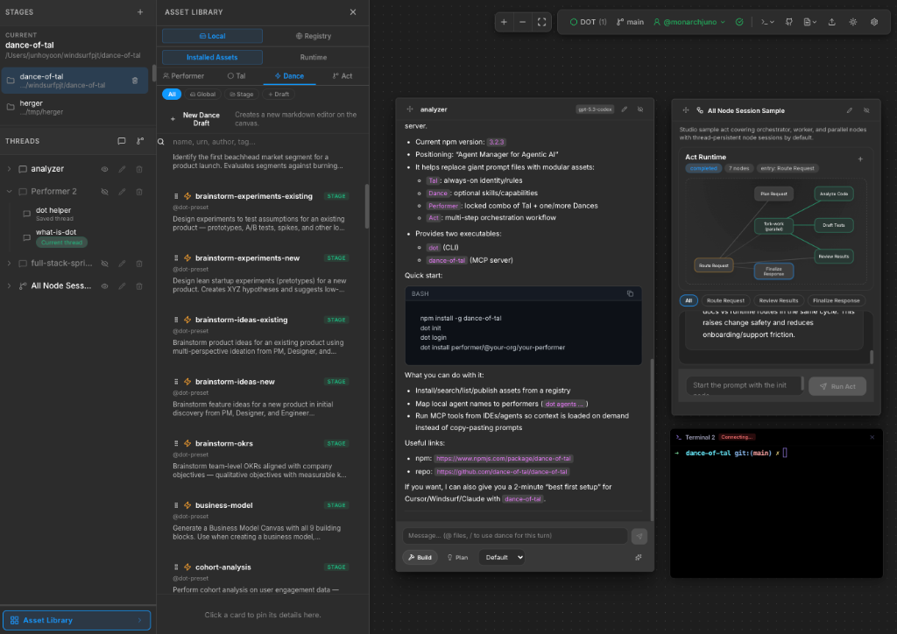

# DOT Studio

> Figma-style workspace for choreographing Dance of Tal performers and Acts on top of OpenCode.

[](https://www.npmjs.com/package/dot-studio)

[](./LICENSE)

[Overview](#overview) • [Get Started](#get-started) • [Core Concepts](#core-concepts) • [Typical Workflow](#typical-workflow) • [CLI](#cli)



DOT Studio is the local visual editor for [Dance of Tal](https://github.com/dance-of-tal/dance-of-tal). Think of it as a Figma-style workspace for AI choreography: you arrange performers on a canvas, define how they relate, and turn those relationships into runnable Acts while [OpenCode](https://github.com/opencode-ai/opencode) handles execution behind the scenes.

You can work in two complementary ways:

- direct manipulation: drag, drop, connect, and edit performers and Acts yourself on the canvas
- assisted editing: ask the built-in Studio Assistant to create or update things when the manual path feels tedious or hard

You can author and connect:

- `Tal`: identity and instruction layers
- `Dance`: reusable skill packages
- `Performer`: runnable agents composed from Tal, Dances, models, and MCP config
- `Act`: multi-performer workflows with runtime collaboration rules

## Overview

DOT Studio is built for local, iterative work.

- Choreograph multiple performers visually on a shared canvas
- Work in a Figma-style editing flow instead of wiring runtime artifacts by hand
- Drag and drop performers and Acts, then refine them with detailed editing controls
- Edit Tal and Dance drafts without leaving the workspace
- Configure models, MCP servers, and runtime settings in one place
- Chat with performers and Act participants from the same UI
- Use the Studio Assistant when you want help building or changing the canvas faster
- Keep everything local while Studio saves workspace state and prepares runtime output for OpenCode

> [!IMPORTANT]
> `.opencode/` is generated output for OpenCode. You usually should not edit it directly.

## Get Started

### Requirements

- Node.js `>=20.19.0`
- An environment supported by Node.js and OpenCode

### Run with `npx`

```bash
npx dot-studio
```

This opens Studio for the current directory and starts the local services it needs.
If the directory has not been initialized as a DOT workspace yet, Studio prepares it automatically.

### Install globally

```bash
npm install -g dot-studio
dot-studio
```

### Fresh DOT setup

If you are starting from a brand new DOT workspace:

```bash
npm install -g dance-of-tal dot-studio
dot init
dot login
dot-studio
```

### Connect to an existing OpenCode instance

DOT Studio can start OpenCode for you, or you can point it to an existing instance:

```bash
OPENCODE_URL=http://localhost:4096 dot-studio
```

## Core Concepts

Studio works with four main building blocks:

- `Tal`: the base identity, behavior, and instruction layer
- `Dance`: a reusable skill or capability package
- `Performer`: an agent made from Tal, Dances, model settings, and MCP configuration
- `Act`: the choreography layer that connects performers and defines how they collaborate

If you are new to DOT Studio, the easiest mental model is:

`Tal + Dance + model + tools = Performer`

`Multiple Performers + choreography = Act`

In other words, Studio is less like a form builder and more like a choreography board for agent systems.

## Typical Workflow

### 1. Open a workspace

Start Studio in a project folder:

```bash
dot-studio
```

Studio opens in your browser and restores the workspace for that directory when available.
You can also point it at another folder with `dot-studio /path/to/project`.

### 2. Create or import assets

Common ways to get started:

- create a new Tal draft
- create a new Dance draft
- import an installed Performer or Act
- drag performers and Acts onto the canvas and start sketching the choreography

### 3. Configure a performer

For each performer, you can typically set:

- a Tal
- one or more Dances
- a model and variant
- MCP servers and related runtime configuration

You can do this directly in the editor with drag-and-drop placement and detailed configuration panels, or let the Studio Assistant help set things up for you.

### 4. Build an Act

Acts are where the choreography comes together.

Typical Act work includes:

- attaching performers as participants
- defining participant relationships
- setting collaboration rules
- chatting with participants in runtime threads

### 5. Chat and iterate

Once a performer or Act is set up, you can use Studio to:

- send prompts
- inspect responses and session state
- review available runtime tools
- keep editing the workspace and run again

> [!NOTE]
> Runtime-affecting edits are picked up on the next execution path. Studio handles projection and runtime refresh for you.

### 6. Use the Studio Assistant

The Studio Assistant is a built-in chat surface for editing the canvas.

Use direct editing when you want precise control. Use the Assistant when you already know the outcome you want but do not want to wire everything manually.

The Assistant is especially useful when:

- you want to scaffold a performer or Act quickly
- you want to make several related changes in one go
- the choreography is getting large and repetitive to edit by hand
- you are exploring and want Studio to help shape the first draft

You can use it to help with tasks like:

- creating Tal or Dance drafts
- creating or updating performers
- creating or updating Acts
- wiring performers together more quickly
- handling edits that would otherwise take several manual drag-and-drop steps

## What You Can Do

- create and edit Tal and Dance drafts
- import installed Performers and Acts onto the canvas
- configure performer models, MCP servers, and runtime settings
- build choreography-driven Acts by connecting participants and defining relationships
- edit directly with drag-and-drop and detailed panels, or delegate tedious setup to the Studio Assistant
- chat with performers, Act participants, and the Studio Assistant
- save and reopen local workspaces as you iterate

## CLI

```bash
dot-studio [path] [options]
dot-studio open [path] [options]
dot-studio doctor [path] [options]
dot-studio --help
dot-studio --version
```

Examples:

```bash
dot-studio
dot-studio ~/projects/dance-of-tal
dot-studio open . --no-open
dot-studio open . --port 3010
dot-studio doctor
dot-studio doctor ~/projects/dance-of-tal --opencode-url http://localhost:4096
```

Behavior:

- `dot-studio` opens the current directory as a workspace
- `dot-studio <path>` opens that directory as a workspace
- if the target directory is not initialized yet, Studio initializes the workspace automatically
- `dot-studio doctor` checks Node.js, workspace path, Studio port, and OpenCode readiness
- `dot-studio --help` shows the built-in CLI help

## Package Scope

This package is the Studio application itself.

- `dot-studio` provides the local visual editor, server, and CLI
- `dance-of-tal` provides DOT contracts, parsing, installation, publishing, and registry-facing behavior
