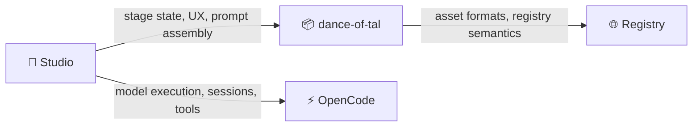

<p align="center">
  
  
  
  
</p>

<h1 align="center">🎭 DOT Studio</h1>

<p align="center">
  <strong>The visual workspace for composing and orchestrating AI agents.</strong><br />
  Build Performers. Wire experimental Act graphs. Watch them run — node by node.
</p>

<p align="center">
  <a href="https://danceoftal.com/docs/studio">Documentation</a> ·
  <a href="https://danceoftal.com">Website</a> ·
  <a href="https://github.com/dance-of-tal/dance-of-tal/issues">Report Bug</a> ·
  <a href="https://github.com/dance-of-tal/dance-of-tal/issues">Request Feature</a>
</p>

<p align="center">
  
</p>

---

## Why DOT Studio?

Most AI tools bury agent behavior behind hidden prompts and opaque configs. DOT Studio makes agent composition **visible, editable, and reusable**.

Website: [danceoftal.com](https://danceoftal.com)

- 🎨 **Performers are workspace objects** — not hidden prompt presets
- 🔀 **Acts are first-class graphs (experimental)** — not ad-hoc routing conventions
- 👁️ **Everything stays visible** — execution history, thread sessions, performer bindings
- 🔌 **MCP assignment is explicit** — project-scoped and inspectable

> **Not just a prettier chat shell.** Studio treats agent behavior as structured workspace state.

---

## ✨ Features

<table>
  <tr>
    <td width="50%">

### 🎭 Performer Composer

Connect **Tal** (identity layer) and **Dance** (skill context) assets, choose models, assign MCP servers, and preview the compiled prompt envelope — all on a visual canvas.

  </td>
    <td width="50%">

### 🔀 Act Editor (Experimental)

Build multi-node AI workflows with **worker**, **orchestrator**, and **parallel** nodes. Set entry points, wire flow and branch edges, and inspect everything directly on the graph.

  </td>
  </tr>
  <tr>
    <td width="50%">

### 🧵 Act Thread Runner (Experimental)

Execute acts and watch output unfold **node-by-node** in real time. Keep node sessions alive across a thread for iterative workflows.

  </td>
    <td width="50%">

### 📦 Draft & Publish

Create Tal and Dance drafts on the canvas, save them locally, and publish through the DOT registry — without leaving Studio.

  </td>
  </tr>
</table>

---

## 🧬 Core Concepts

| Concept | Description |
|:---|:---|
| **Tal** | The always-on instruction layer — identity, rules, and baseline behavior |
| **Dance** | Optional skill or capability context, loaded on demand |
| **Performer** | A runnable composition of Tal + Dance + model + agent mode + MCP bindings |
| **Act** | An experimental directed workflow graph of worker, orchestrator, and parallel nodes |
| **Stage** | The saved Studio workspace state for a project |

---

## 🚀 Quick Start

### One-liner

```bash
npx dot-studio .
```

### Global install

```bash
npm install -g dot-studio
dot-studio .
```

> **Flags:** `dot-studio [projectDir]` · `dot-studio --no-open [projectDir]` · `dot-studio --port 3005 [projectDir]`
>
> If no port is specified, DOT Studio starts from `3001` and automatically picks the next free port when that port is already in use.
>
> When you launch the published CLI interactively, it checks npm for a newer `dot-studio` version and asks whether to update before starting.

---

## 🛠️ Development

### Prerequisites

- **Node.js** `≥ 20.19.0` (repo pins `22.22.1` via `.nvmrc`)
- macOS or Linux recommended

### Setup

```bash
npm install
npm run dev:all
```

This spins up three processes:

| Service | URL |
|:---|:---|
| Vite (client) | `http://localhost:5173` |
| Hono (API) | `http://localhost:3001` |
| OpenCode (runtime) | `http://localhost:4096` |

> The Vite dev server proxies `/api` and `/ws` — browser traffic stays same-origin.

### Commands

```bash
npm run dev          # Client only
npm run server       # API server only
npm run type-check   # Full type checking
npm run build:all    # Production build
```

### Packaging

```bash
npm run type-check
npm run pack:check
npm pack
```

Smoke test:
```bash
npx dot-studio --no-open <projectDir>
```

---

## 🏗️ Architecture

```
studio/
├── src/           # React app, canvas components, state slices
├── server/        # Hono routes, OpenCode integration, act runtime
├── shared/        # Cross-runtime helpers and metadata utilities
├── client/        # Built browser assets (generated)
└── cli.ts         # CLI entry point
```

### Runtime Boundaries



> Studio is the **workspace layer** — it orchestrates UX and state, while OpenCode owns the actual model runtime.

---

## 🧰 Tech Stack

| Layer | Technology |
|:---|:---|
| Frontend | React 19, Zustand, React Flow, Vite |
| Backend | Hono, tsx |
| Orchestration | XState |
| AI Runtime | OpenCode SDK |
| Asset System | dance-of-tal |

---

## 🤝 Contributing

Contributions are welcome! Here's how to get started:

1. Fork the repo and create your branch from `main`
2. Run `npm run type-check` before pushing
3. Keep runtime behavior aligned with DOT asset semantics
4. Treat OpenCode as the execution authority — don't re-implement it in Studio

## 📄 License

[MIT](./LICENSE) © [monarchjuno](https://github.com/monarchjuno)

---

<p align="center">
  Built with 🎭 by the <a href="https://danceoftal.com">Dance of Tal</a> community
</p>
